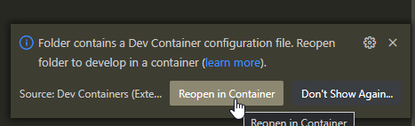
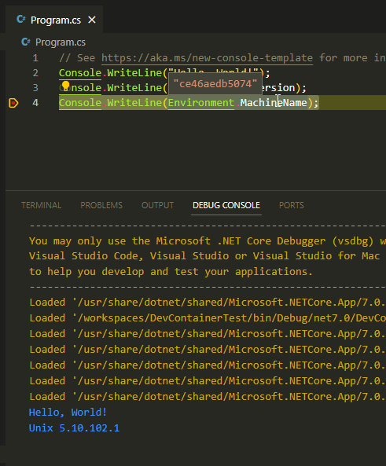

# DevContainerTest


This Repo only contains a sample for [this Podman Desktop Issue (#832)](https://github.com/containers/podman-desktop/issues/832)


## Getting Started

This repo was configured to work with Docker Desktop & the Remote Container Development (Zero-Config. Only install Docker Desktop & the Extension).


1. Clone repo
2. Open in DevContainer (with possible Podman Desktop Extension)

    
3. Open yourself a beer and wait for the dev container to start
4. Hit F5 to start/debug the project. There should be the following output:

    ```
    Hello, World!
    Unix 5.10.102.1
    ce46aedb5074        //Container Id
    ```
5. (optional): add breakpoint & test if debugging works

    